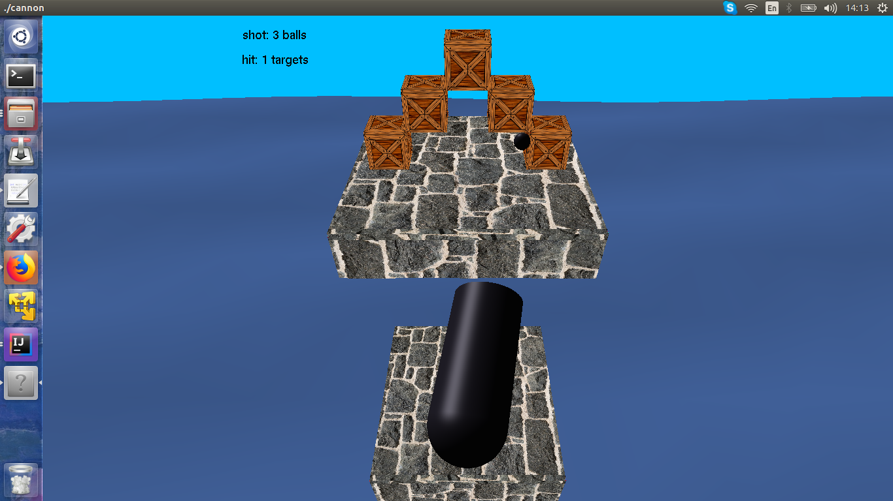

# RG062-cannon-shooting-target


This is a cannon ball shooting game made using C with openGL.


## Usage when on keyboard mode

<table>
  <tr>
    <th colspan="2">Global</th>
  </tr>
  <tr>
    <td>Exit</td><td>Esc</td>
  </tr>
  <tr>
    <td>Switch to keyboard</td><td>k/K</td>
  </tr>
  <tr>
    <th colspan="2">Cannon rotation</th>
  </tr>
  <tr>
    <td>Left</td><td>a</td>
  </tr>
  <tr>
    <td>Right</td><td>d</td>
  </tr>
  <tr>
    <td>Up</td><td>w</td>
  </tr>
  <tr>
    <td>Down</td><td>s</td>
  </tr>
  <tr>
    <th colspan="2"> Cannon shooting </th>
  </tr>
    <tr>
        <td>Shoot</td><td>q</td>    
    </tr>
    <tr>
        <td>Reload</td><td>r</td>
    </tr>
</table>


## Usage when on mouse mode

<table>
  <tr>
    <th colspan="2">Global</th>
  </tr>
  <tr>
    <td>Exit</td><td>Esc</td>
  </tr>
  <tr>
    <td>Switch to keyboard</td><td>k/K</td>
  </tr>
  <tr>
    <th colspan="2">Cannon rotation</th>
  </tr>
  <tr>
    <td colspan="2">Mouse movement</td>
  </tr>
  <tr>
    <th colspan="2">Cannon shooting</th>
  </tr>
    <tr>
        <td>Shoot</td><td>left mouse button</td>    
    </tr>
    <tr>
        <td>Reload</td><td>right mouse button</td>
    </tr>
</table>

## Setup

1. Compile

    ```sh
	make

    ```

2. Start

    ```sh
	./cannon

    ```

***
## Contact

Marija Filipovic – [@Linkedin](https://www.linkedin.com/in/marija-filipovic/) – marija-filipovic@outlook.com
